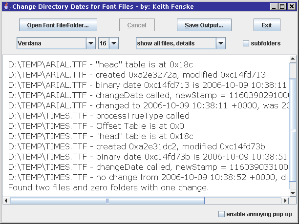

### Font Redate (Java)

by: Keith Fenske, https://kwfenske.github.io/

FontRedate is a Java 1.4 application to read internal dates from OpenType,
PostScript, or TrueType font files, and to change the file modification dates
to match. The file contents are not changed, only the date in the system file
directory. Internal font dates may or may not be accurate; many fonts are
created and later edited without setting the date properly. Times may differ
from what you expect depending upon your time zone, and will usually agree with
what the Microsoft Font Properties Extension shows in its Version tab for
OTF/TTC/TTF files, plus or minus daylight saving time.

Download the ZIP file here: https://kwfenske.github.io/font-redate-java.zip

Released under the terms and conditions of the Apache License (version 2.0 or
later) and/or the GNU General Public License (GPL, version 2 or later).

